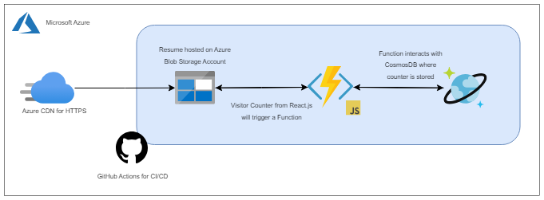

# My Azure Portfolio
An Azure Portfolio/Resume inspired by an ACG project, showcasing my skills in web development and cloud engineering. Built with React.js, HeroUI, Tailwind CSS for the frontend, Azure Functions and JavaScript for the backend, and hosted on Azure Storage Accounts. This project highlights my ability to design and deploy cloud-based solutions while combining creativity and technical expertise in modern web development.

## Backend Architecture

  

